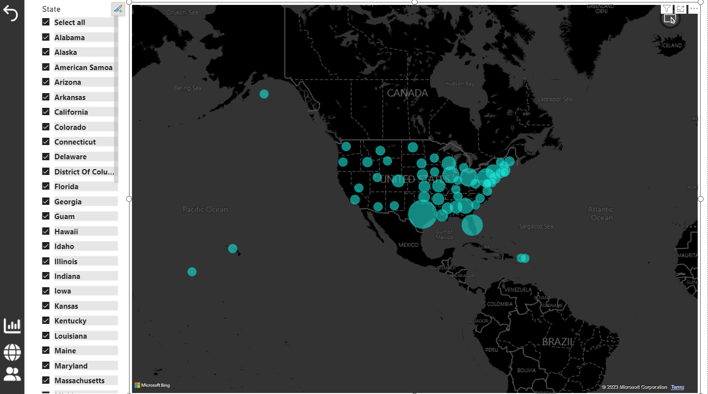
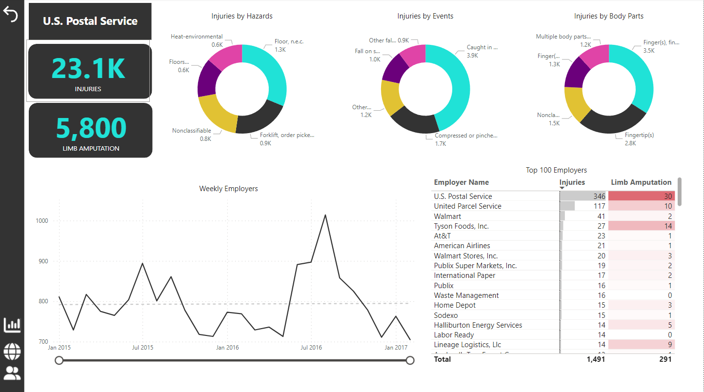

# OSHA-Insights-PowerBI

## Project Overview
"OSHA-Insights-PowerBI" is a Power BI dashboard project designed to enhance workplace safety by providing detailed insights into work-related injuries, with a specific focus on preventing amputations. This project leverages extensive data from the Occupational Safety and Health Administration (OSHA) to analyze, visualize, and predict injury trends and risks.

## Objectives
- **Enhance Workplace Safety**: Utilize data-driven insights to mitigate severe work-related injuries.
- **Predictive Analysis**: Employ machine learning models to predict potential injury risks.
- **Interactive Visualizations**: Offer stakeholders intuitive and actionable insights through interactive Power BI dashboards.

## Features
- **Main Dashboard**: Overview of total incidents, amputation counts, and severity ratings.
- **Geographical Insights**: Map visualization displaying the distribution of injuries across regions.
- **Employer-Specific Analysis**: Detailed breakdown by employer to identify high-risk areas and practices.

## Technologies Used
- **Power BI**: For creating and hosting interactive dashboards.
- **Python**: Used in backend for data preprocessing and machine learning model development.
- **Random Forest Algorithm**: For predictive analytics to foresee future injury risks.

## How to Use the Dashboard
1. **Access the Dashboard**: Navigate to the provided Power BI link (insert link here).
2. **Explore Various Views**: Use the tabs to switch between different dashboard views such as the Main Dashboard, Map View, and Employer Analysis.
3. **Interact with Visuals**: Click on different elements within the dashboard to drill down into specific data points.

## Screenshots

Below are screenshots from the OSHA-Insights-PowerBI dashboard, illustrating the type of insights and analytics provided.

*Figure 1: Main Dashboard showing overall statistics and trends.*

*Figure 2: Geographic distribution of work-related injuries.*

*Figure 3: Analysis of incidents by employer.*
